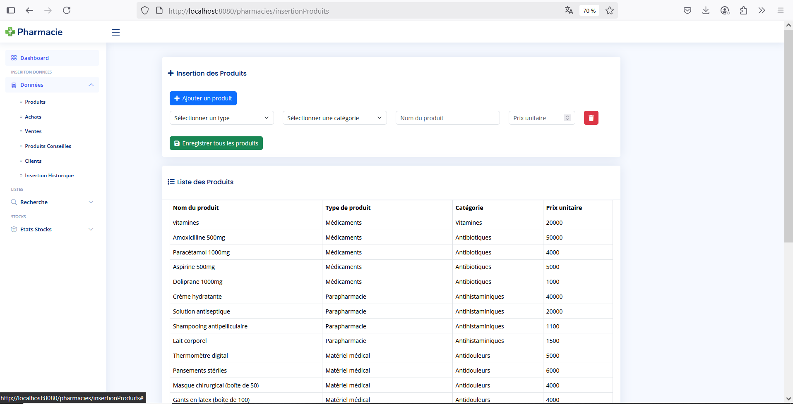
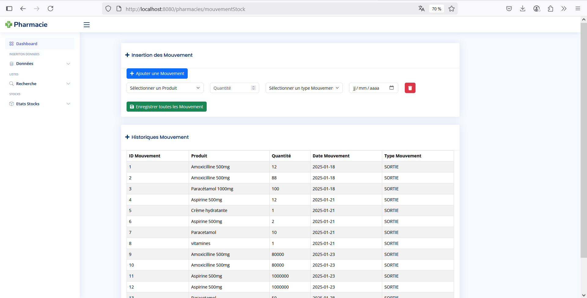
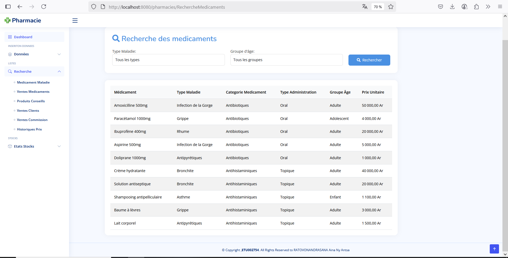

# 💊 Système de Gestion de Pharmacie

Un système complet de gestion de pharmacie développé en Java/JSP avec une interface moderne et intuitive pour gérer efficacement les opérations pharmaceutiques quotidiennes.

## 🚀 Fonctionnalités Principales

### 📦 **Gestion des Produits**
- **Insertion multiple de produits** avec classification par types et catégories
- **Recherche multicritères** (nom, type, catégorie, prix)
- **Gestion spécialisée des médicaments** avec filtrage par type de maladie et groupe d'âge
- **Suivi historique des prix** avec traçabilité complète des modifications

### 💰 **Gestion des Ventes & Commissions**
- **Enregistrement des ventes** avec liaison automatique aux vendeurs
- **Système de commissions** (5% sur les ventes ≥ 200,000 Ar)
- **Analyse des performances** par vendeur et par genre
- **Filtrage avancé** par période, vendeur, et type de produits

### 📊 **Gestion des Stocks**
- **Suivi en temps réel** des niveaux de stock
- **Insertion multiple** pour mise à jour rapide
- **Traçabilité des mouvements** (entrées/sorties)
- **Alertes de stock** pour éviter les ruptures

### 👥 **Gestion de la Clientèle**
- **Base de données clients** complète
- **Historique des achats** par client
- **Analyse des comportements** d'achat
- **Suivi des ventes quotidiennes**

### 🏆 **Produits Conseillés**
- **Recommandations mensuelles** personnalisables
- **Filtrage par période** et catégories
- **Historique des recommandations** avec analyse de performance

### 🔍 **Recherche & Filtrage Avancés**
- **Recherche multicritères** sur tous les modules
- **Filtres par groupes d'âge** (enfants, adolescents, adultes)
- **Filtres par types d'administration** (oral, topique, injectable)
- **Recherche par maladies** et indications thérapeutiques

## 🛠️ Installation & Déploiement

### **Prérequis**
- **JDK 17 ou supérieur** (recommandé: JDK 19.0.2)
- **XAMPP v3.3.0** (avec Tomcat inclus)
- **PostgreSQL 15**

### **Configuration de la Base de Données**
Exécutez les scripts SQL situés dans le dossier `sql` dans l'ordre suivant :
1. `table.sql`
2. `data.sql`
3. `view.sql`
4. `function.sql`

### **Installation**
Clonez le projet depuis GitHub :
```bash
git clone https://github.com/antsamadagascar/Pharmacie.git
```

### **Déploiement**
1. Ouvrez le fichier `build.bat`
2. Mettez à jour les chemins selon votre installation Tomcat :
```bat
set "root=C:\xampp\tomcat\webapps\pharmacies"
set "target_dir=%root%\lib"
set "config_target_dir=%root%\web\WEB-INF\classes\config"
```

3. Vérifiez votre version Java :
```bash
java -version
```

4. Naviguez vers le dossier contenant `build.bat`
5. Exécutez le script :
```bash
build.bat
```

Le script va :
- Compiler tous les fichiers `.java` avec `--release 17`
- Créer un fichier `.jar`
- Copier les fichiers compilés vers les répertoires Tomcat appropriés
- Lancer automatiquement le navigateur à : [http://localhost:8080/pharmacies/](http://localhost:8080/pharmacies/)

> ⚠️ **Note** : Si vous utilisez une version Java différente, modifiez la ligne suivante dans `build.bat` :
> ```bat
> javac --release 17 -d "%bin%" -cp "%lib%\*" *.java
> ```
> Remplacez `--release 17` par votre version (ex: `--release 11`)

## 📱 Interface Utilisateur

### **Tableau de Bord**
- Vue d'ensemble des opérations quotidiennes
- Accès rapide à toutes les fonctionnalités
- Navigation intuitive par modules

### **Modules Principaux**

#### 💊 **Gestion des Produits**

*Interface d'insertion multiple des produits avec classification par types et catégories*

#### 📦 **Gestion des Stocks**


*Suivi en temps réel des stocks avec historique des mouvements*

#### 🔍 **Recherche de Médicaments**

*Recherche avancée avec filtres par type de maladie et groupe d'âge*

- **Insertion/Données** : Ajout de produits, stocks, clients
- **Recherche** : Filtrage avancé et recherche multicritères
- **États/Stocks** : Rapports et suivi des inventaires
- **Analyses** : Commissions, historiques, performances

## 🎯 **Fonctionnalités Détaillées**

Pour une description complète des fonctionnalités, consultez : [**📋 Fonctionnalités Détaillées**](FEATURES.md)

## 🏗️ **Architecture Technique**

### **Backend**
- **Java/JSP** pour la logique métier
- **Servlets** pour la gestion des requêtes
- **DAO Pattern** pour l'accès aux données
- **PostgreSQL** comme base de données

### **Frontend**
- **Interface responsive** avec Bootstrap
- **Formulaires dynamiques** avec validation,utilisation de ajax et Jquery
- **Tableaux interactifs** pour l'affichage des données
- **Navigation par sidebar** intuitive

## 📈 **Avantages du Système**

✅ **Interface intuitive** et ergonomique  
✅ **Fonctions d'insertion multiple** pour gain de temps  
✅ **Traçabilité complète** de toutes les opérations  
✅ **Gestion multi-utilisateurs** avec commissions  
✅ **Recherche avancée** sur tous les critères  

## 🔧 **Support & Maintenance**

- **Logs détaillés** pour le débogage
- **Structure modulaire** pour faciliter les évolutions
- **Code documenté** et maintenable
- **Base de données optimisée** avec vues,function et index

## 📞 **Contact & Support**

Pour toute question ou support technique, n'hésitez pas à créer une issue sur le repository GitHub.

---
